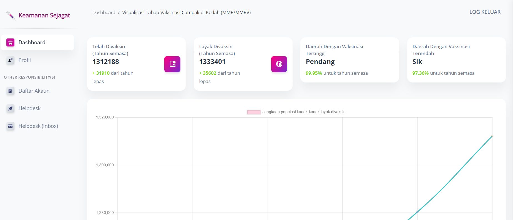

# [Kedah Aman Sejagat](https://keagat.com.my) 

  [](https://github.com/naisyahisa/keagat/issues?q=is%3Aopen+is%3Aissue) [](https://github.com/naisyahisa/keagat/issues?q=is%3Aissue+is%3Aclosed)

Keagat is the Kedah Measles Herd Immunity Prediction System that was proposed to serve a platform for the healthcare staff be on the right track in tracking the measles herd immunity percentage of Kedah population, which is never being started before in any state health department in Malaysia. Hoping to assist the JKN Kedah staff easily access, analyze data visualization, be alert with any possibilities regarding the measles herd immunity percentage all at one.


> Features

- Up-to-date [dependencies](./requirements.txt): **Django 3.2.6 LTS**
- [SCSS compilation](#recompile-css) via **Gulp**
- Django Codebase
- UI-Ready app, SQLite Database, MySql Database
- Modular design
- Session-Based Authentication, Forms validation
- Deployment scripts: Docker, Gunicorn / Nginx

<br />



<br />

## Table of Contents

* [Demo](#demo)
* [Quick Start](#quick-start)
* [Documentation](#documentation)
* [File Structure](#code-base-structure))
* [Deployment](#deployment)
* [Browser Support](#browser-support)
* [Resources](#resources)
* [Reporting Issues](#reporting-issues)
* [Technical Support or Questions](#technical-support-or-questions)
* [Disclaimer](#disclaimer)

<br />

## Demo

> To authenticate use the default credentials ***staff1 / zaq1@WSX*** or create a new user on the **registration page**.

- **Keagat** [Login Page](https://keagat.com.my/login)

<br />

## Quick start

> UNZIP the sources or clone the repository. After getting the code, open a terminal and navigate to the working directory, with product source code.

```bash
$ # Get the code
$ git clone https://github.com/naisyahisa/keagat.git
$ cd keagat
$
$ # Virtualenv modules installation (Unix based systems)
$ # virtualenv env
$ # source env/bin/activate
$
$ # Virtualenv modules installation (Windows based systems)
$ virtualenv env
$ .\env\Scripts\activate
$
$ # Install modules - Mysql Storage
$ pip install -r requirements.txt
$
$ # Create tables
$ python manage.py makemigrations
$ python manage.py migrate
$
$ # Start the application (development mode)
$ python manage.py runserver # default port 8000
$
$ # Start the app - custom port
$ # python manage.py runserver 0.0.0.0:<your_port>
$
$ # Access the web app in browser: http://127.0.0.1:8000/
```

> Note: To use the app, please access the registration page and create a new user. After authentication, the app will unlock the private pages.

<br />

## Documentation
The documentation for the **Keagat** is hosted at our [website](https://www.keagat.com.my).

<br />

## Code-base structure

The project is coded using a simple and intuitive structure presented bellow:

```bash
< PROJECT ROOT >
   |
   |-- core/                               # Implements app configuration
   |    |-- settings.py                    # Defines Global Settings
   |    |-- wsgi.py                        # Start the app in production
   |    |-- urls.py                        # Define URLs served by all apps/nodes
   |
   |-- apps/
   |    |
   |    |-- home/                          # A simple app that serve HTML files
   |    |    |-- views.py                  # Serve HTML pages for authenticated users
   |    |    |-- urls.py                   # Define some super simple routes  
   |    |
   |    |-- authentication/                # Handles auth routes (login and register)
   |    |    |-- urls.py                   # Define authentication routes  
   |    |    |-- views.py                  # Handles login and registration  
   |    |    |-- forms.py                  # Define auth forms (login and register) 
   |    |
   |    |-- static/
   |    |    |-- <css, JS, images>         # CSS files, Javascripts files
   |    |
   |    |-- templates/                     # Templates used to render pages
   |         |-- includes/                 # HTML chunks and components
   |         |    |-- navigation.html      # Top menu component
   |         |    |-- sidebar.html         # Sidebar component
   |         |    |-- footer.html          # App Footer
   |         |    |-- scripts.html         # Scripts common to all pages
   |         |
   |         |-- layouts/                   # Master pages
   |         |    |-- base-fullscreen.html  # Used by Authentication pages
   |         |    |-- base.html             # Used by common pages
   |         |
   |         |-- accounts/                  # Authentication pages
   |         |    |-- login.html            # Login page
   |         |    |-- register.html         # Register page
   |         |
   |         |-- home/                      # UI Kit Pages
   |              |-- index.html            # Index page
   |              |-- 404-page.html         # 404 page
   |              |-- *.html                # All other pages
   |
   |-- requirements.txt                     # Development modules - SQLite storage
   |
   |-- .env                                 # Inject Configuration via Environment
   |-- manage.py                            # Start the app - Django default start script
   |
   |-- ************************************************************************
```

<br />

> The bootstrap flow

- Django bootstrapper `manage.py` uses `core/settings.py` as the main configuration file
- `core/settings.py` loads the app magic from `.env` file
- Redirect the guest users to Login page
- Unlock the pages served by *app* node for authenticated users

<br />

## Recompile CSS

To recompile SCSS files, follow this setup:

<br />

**Step #1** - Install tools

- [NodeJS](https://nodejs.org/en/) 12.x or higher
- [Gulp](https://gulpjs.com/) - globally 
    - `npm install -g gulp-cli`
- [Yarn](https://yarnpkg.com/) (optional) 

<br />

**Step #2** - Change the working directory to `assets` folder

```bash
$ cd apps/static/assets
```

<br />

**Step #3** - Install modules (this will create a classic `node_modules` directory)

```bash
$ npm install
// OR
$ yarn
```

<br />

**Step #4** - Edit & Recompile SCSS files 

```bash
$ gulp scss
```

The generated file is saved in `static/assets/css` directory.

<br /> 

## Deployment

The app is provided with a basic configuration to be executed in [Docker](https://www.docker.com/), [Gunicorn](https://gunicorn.org/), and [Waitress](https://docs.pylonsproject.org/projects/waitress/en/stable/).

### [Docker](https://www.docker.com/) execution
---

The application can be easily executed in a docker container. The steps:

> Get the code

```bash
$ git clone https://github.com/naisyahisa/keagat.git
$ cd Keagat
```

> Start the app in Docker

```bash
$ sudo docker-compose pull && sudo docker-compose build && sudo docker-compose up -d
```

Visit `http://localhost:85` in your browser. The app should be up & running.

<br />

## Browser Support

At present, we officially aim to support the last two versions of the following browsers:

    

<br />

## Resources

- Demo: <https://keagat.com.my>
- Download Page: <https://github.com/naisyahisa/keagat>
- Documentation: <https://github.com/naisyahisa/keagat/README.md>
- License Agreement: <https://www.creative-tim.com/license>
- Issues: [Github Issues Page](https://github.com/naisyahisa/keagat/issues)

<br />

## Reporting Issues

We use GitHub Issues as the official bug tracker for the **Keagat**. Here are some advices for our users that want to report an issue:

1. Make sure that you are using the latest version of the **Keagat**. Check the CHANGELOG from your dashboard on our [website](https://keagat.com.my/changelog).
2. Providing us reproducible steps for the issue will shorten the time it takes for it to be fixed.
3. Some issues may be browser-specific, so specifying in what browser you encountered the issue might help.

<br />

## Technical Support or Questions

If you have questions or need help integrating the product please [contact us](https://github.com/naisyahisa)


<br />

## Disclaimer

The information provided by this repo on keagat.com.my is a prototype for our final year student project only. All information on the Site is provided in good faith, however we make no representation or warranty of any kind, express or implied, regarding the accuracy, adequacy, validity, reliability, availability or completeness of any information on the Site.

Under no circumstance shall we have any liability to you for any loss or damage of any kind incurred as a result of the use of the site or reliance on any information provided on the site. Your use of the site and your reliance on any information on the site is solely at your own risk.

The data on the Site are not intended, nor should they be construed, as claims that our products and/or services can be used to diagnose, treat, mitigate, cure, prevent or otherwise be used for any disease or medical condition. No testimonials have been clinically proven or evaluated.
<br />

---
[Keagat - Kedah Aman Sejagat](https://github.com/naisyahisa/keagat) - Coded by [naisyahisa](https://github.com/naisyahisa) 2022
